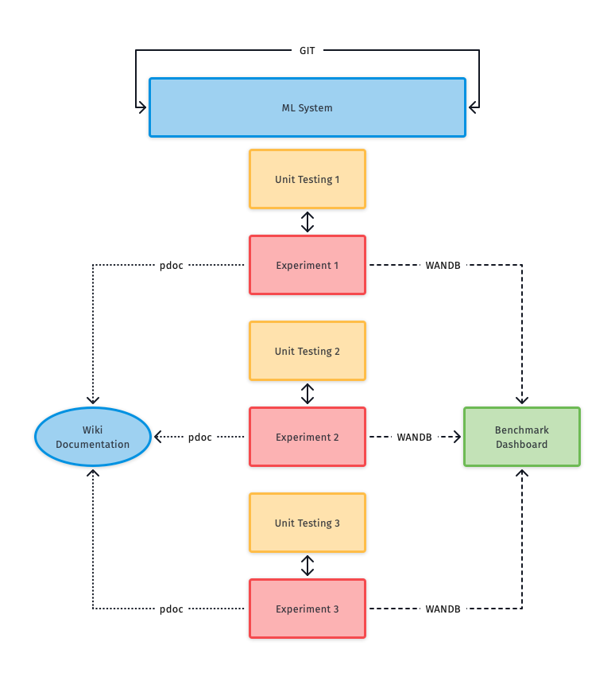

# Putting It All Together {#putting-it-all-together} 

## Workflow

An overview of the entire workflow to good collaboration on ML projects.

## Concluding Remarks

Getting started with Colab and VS Code is super easy. However, to avoid hassles for long-term projects & collaborations it is best to establish sane practices early on. Hopefully, following this guide and the many references on here give you the neccessary peace of mind. Code on!
